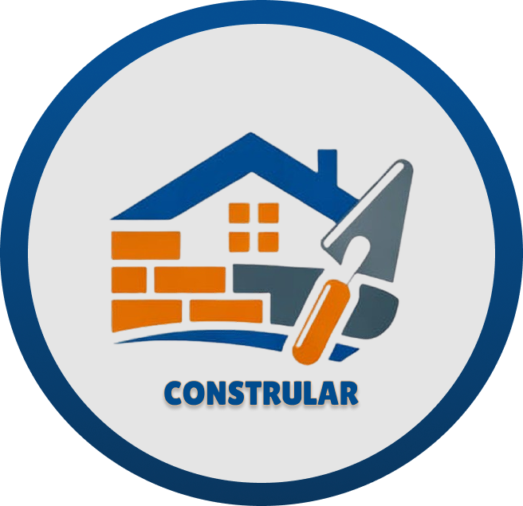

<h1>Software - Materiais de Construção</h1>
<h3>3º Semestre (Fatec) - Projeto Interdisciplinar</h3>
 

<h2>Integrantes da Equipe</h2>

  <table>
    <thead>
      <tr>
        <th>Nome</th>
        <th>Função</th>
      </tr>
    </thead>
    <tbody>
      <tr>
        <td><a href= "https://github.com/AleksGustavo">Aleksander Gustavo</a></td>
        <td>PO, Engenharia de Software</td>
      </tr>
      <tr>
        <td><a href= "https://github.com/beamrt"> Beatriz Martins</a></td>
        <td>UI/UX, Desenvolvedora Front-End</td>
      </tr>
      <tr>
        <td><a href= "https://github.com/1freelipe">Felipe Rodrigues Teixeira</a></td>
        <td>Desenvolvedor Front-End</td>
      </tr>
      <tr>
        <td><a href= "hhttps://github.com/mateus-cc">Mateus César Costa</a></td>
        <td>Desenvolvedor Back-End</td>
      </tr>
      <tr>
        <td><a href= "https://github.com/marcos22-s">Marcos Firmino</a></td>
        <td>Desenvolvedor Back-End</td>
      </tr>
    </tbody>
  </table>
  

<h3>Tecnologias Utilizadas</h3>

  
  
  
  
  

